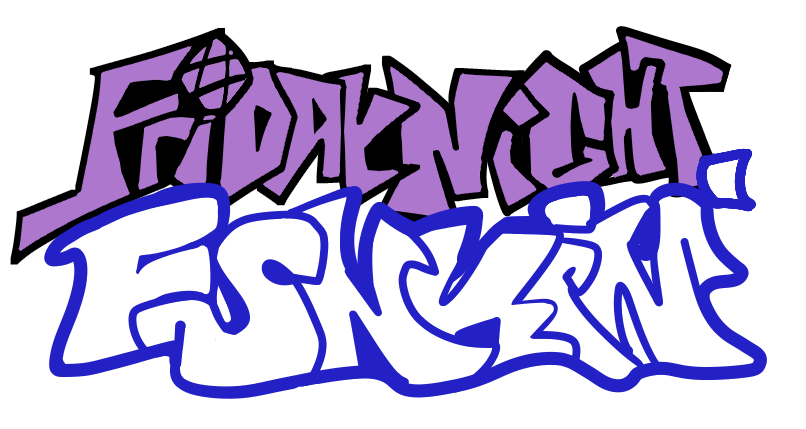

# Friday Night Funkin' Legacy — Modern Haxe Edition!

A modernized version of [Funkin Legacy](https://github.com/FunkinCrew/Funkin/tree/legacy/0.2.x) compatible with the latest Haxe releases. The original code was built with Haxe 4.1.5 and now compiles cleanly on current versions!



### Credits / shoutouts (Original Creators)
#### Programming
- [ninjamuffin99](https://twitter.com/ninja_muffin99) - Lead Programmer
- [EliteMasterEric](https://twitter.com/EliteMasterEric) - Programmer
- [MtH](https://twitter.com/emmnyaa) - Charting and Additional Programming
- [GeoKureli](https://twitter.com/Geokureli/) - Additional Programming
- [ZackDroid](https://x.com/ZackDroidCoder) - Lead Mobile Programmer
- [MAJigsaw77](https://github.com/MAJigsaw77) - Mobile Programmer
- [Karim-Akra](https://x.com/KarimAkra_0) - Mobile Programmer
- [Sector_5](https://github.com/sector-a) - Mobile Programmer
- [Luckydog7](https://github.com/luckydog7) - Mobile Programmer
#### Art / Animation / UI
- [PhantomArcade3K](https://twitter.com/phantomarcade3k) - Artist and Animator
- [Evilsk8r](https://twitter.com/evilsk8r) - Art
- [Moawling](https://twitter.com/moawko) - Week 6 Pixel Art
- [IvanAlmighty](https://twitter.com/IvanA1mighty) - Misc UI Design
#### Music
- [Kawaisprite](https://twitter.com/kawaisprite) - Musician
- [BassetFilms](https://twitter.com/Bassetfilms) - Music for "Monster", Additional Character Design
#### Special Thanks
- [Tom Fulp](https://twitter.com/tomfulp) - For being a great guy and for Newgrounds
- [JohnnyUtah](https://twitter.com/JohnnyUtahNG/) - Voice of Tankman
- [L0Litsmonica](https://twitter.com/L0Litsmonica) - Voice of Mommy Mearest

### Whats the Goal?

The goal of this project is to fully convert the original [Friday Night Funkin' Legacy Branch](https://github.com/FunkinCrew/Funkin/tree/legacy/0.2.x), into a fully modern Haxe environment, while keeping the gameplay and behavior as **accurate** to the **original** as possible

Specifically, this project aims to:

* Port the original **0.2.x Legacy branch** of Friday Night Funkin' to modern [Haxe (4.3.7+)](https://haxe.org/download/version/4.3.7/)
* Maintain compatibility with current versions of HaxeFlixel and Lime
* Clean up deprecated or outdated code
* Preserve vanilla behavior and logic wherever possible
* Introduce **modern, optional quality-of-life improvements** that do not alter the original experience unless enabled
* Add **Legacy** and **Modern Chart support** across all Friday Night Funkin' versions
* Maintain the original Open License

### Design

This is **not** a gameplay overhaul or a redesign.

The intent is:
* Preserve the *original feel*
* Modernize the *technical foundation*
* Add optional improvements without forcing changes on purists

Think of it as:

> The original game rebuilt on a modern engine foundation.

### TL:DR
In short: this branch keeps the **classic feel of Legacy** while giving it a modern foundation that’s easier to run, maintain, and enhance.


## Prerequisites

Before you start, make sure you have the following installed:

- **Haxe 4.3.7** — [Download here](https://haxe.org/download/version/4.3.7/)
- **Visual Studio Community 2019** (Windows only) — See setup instructions below
- **Git** — For cloning the repository

### Windows Setup (Visual Studio)

If you're on Windows, you need to install Visual Studio Community 2019. During installation:
1. Skip the workloads section
2. Go to the **Individual Components** tab
3. Select these components:
   - MSVC v142 - VS 2019 C++ x64/x86 build tools
   - Windows SDK (10.0.17763.0)

## Getting Started

### 1. Clone the Repository

```bash
git clone https://github.com/Smoffyy/funkin-legacy-haxe-modern.git
cd funkin-legacy-haxe-modern
```

### 2. Install HaxeFlixel

[Follow the official HaxeFlixel installation guide](https://haxeflixel.com/documentation/install-haxeflixel/)

### 3. Install Dependencies

In the project directory, run:

```bash
haxelib setup
haxelib install haxelib.json --always
```

### 4. Initialize Lime (First Time Only)

If you haven't used Lime before, run:

```bash
haxelib run lime setup
```

## Compiling the Game

From the project root directory, run:

```bash
lime test <platform>
```

Replace `<platform>` with your target: `windows`, `html5`, `linux`, or `mac`.

For example, to compile for Windows:
```bash
lime test windows
```

### Debug Mode

When developing, add the `-debug` flag:

```bash
lime test windows -debug
```

The compilation process takes a while even on powerful machines. Once complete, you'll find the compiled executable in `export/release/windows/bin/` (or the equivalent folder for your platform).

## Troubleshooting

**Mac users:** If `lime test mac -debug` doesn't work, search for Haxe-specific Mac compilation guides — your setup may require additional configuration.

## Next Steps

Once compiled successfully, you can open and run the game from the generated `.exe` (Windows) or equivalent executable for your platform.